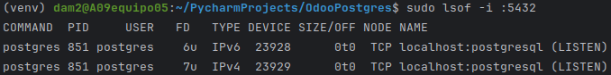

# README - Odoo Instalación con Docker Compose

Este repositorio contiene los archivos necesarios para configurar Odoo utilizando Docker Compose. Sigue las instrucciones a continuación para realizar la instalación y configuración.

## Configuración de Odoo con Docker Compose

**1. Crear un  Dockerfile 'docker-compose.yml' con la siguiente configuración:**
- Un archivo de configuración de Odoo
   - Dentro de este se deben poner los valores de las variables de entorno que se van a utilizar en el archivo de docker-compose.yml para inicializar el Odoo junto a la imagen y el puerto que escojas.
- Un archivo de configuración de Postgres
    - Dentro de este se deben poner los valores de las variables de entorno que se van a utilizar en el archivo de docker-compose.yml para inicializar el Postgres que sera la base de datos de mi Odoo, además de esto tambien debe contener el puerto con los valores correctos.

**2. Despues de esto conecto my docker-compose.yml con el pycharm para poder comprobar la base de datos.**
- Para ello entro en apartado de Database y le doy a la opcion de + y selecciono la opcion de Postgres.
- Despues le pongo los valor de entorno que he puesto en el docker-compose.yml y le doy a test connection para comprobar que todo esta correcto.
- Despues de esto le doy a apply y a ok para que se guarde la configuracion.

**3. Inicio el docker compose**
- Para ello voy al terminal y pongo el comando de docker-compose up -d para que se inicie el docker-compose.yml.
- Despues de esto voy a la pagina de localhost:(el puerto que haya configurado my odoo) para comprobar que todo esta correcto y que se ha iniciado correctamente.
    - Si todo esta correcto me saldra la pagina de odoo para que pueda iniciar sesion.
    ### Imagen de la pagina de Odoo
    

## Problema que me encontré
El unico problema que me he encontrado estaba relacionado con los puertos de postgres dentro del docker-compose.yml, ya que m decia que estos estaban ocupados.
Para solucionarlo tuve que ejecutar los siguientes comandos:
- Para comprobar si el puerto de postgres estaba ocupado.
  - ```sudo lsof -i -P -n | grep LISTEN```
- 
- Aqui se puede ver que el puerto de postgres esta ocupado por lo que ejecute un comando que iba a parar todos los posgres que estuviesen activos.
  - ```sudo service postgresql stop```
- Despues de esto volvi a ejecutar el comando de comprobacion de los puertos y ya no me salia el puerto de postgres, asi que ya estaba libre para poder utilizarlo.
- Vuelvo a lanzar el ```docker-compose up -d``` y ya se me inicia correctamente.


